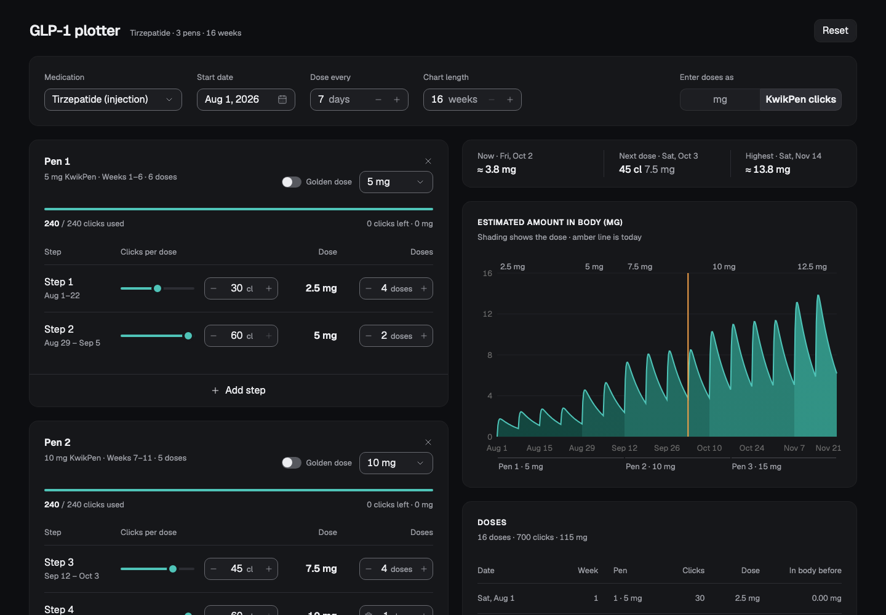

# GLP-1 Plotter

Plot the estimated amount of a GLP-1 medication in your body over a titration plan, and plan tirzepatide KwikPens by clicks.

**[Open the plotter](https://bilal-psd.github.io/glp-1-dosage-planner/)**



## What it does

- **Plan in steps.** Each step is a dose and a number of doses, dosed every N days. Pause steps are allowed.
- **See the curve.** The chart shows the estimated mg in the body over time, shaded by dose, with today's level, the next dose and the peak.
- **Plan KwikPens by clicks** (tirzepatide). Pick each pen's strength, dial doses in clicks (60 clicks = one labelled dose) and see how many clicks and mg each pen has left, with or without the golden dose.
- **Share and export.** Copy a share link, export the plan as JSON (and import it again), or export the chart as PNG or the whole plan as a PDF.
- **Private by design.** Everything runs in your browser. No accounts, no server; the plan is saved in your browser's local storage.

Supported medications: tirzepatide (injection), semaglutide (injection and oral) and retatrutide (injection).

## Not medical advice

The curve is an estimate from a one-compartment population model, not a measurement of your levels. It doesn't recommend doses. Talk to your prescriber about your treatment.

## How the estimate works

The model and drug constants are ported from [glapp.io](https://glapp.io)'s plotter, so results are directly comparable with it. Each dose adds a Bateman absorption curve; the doses are summed and plotted as mg in the body. glapp-style links (`?medication1=…&dose1=…`) open as they are. The one deliberate difference: a one-week step gives exactly one dose.

The constants and maths are listed in [AGENTS.md](AGENTS.md).

## Run it locally

Requires Node.js 20.19+ or 22.12+.

```bash
npm --prefix app install
npm --prefix app run dev
```

Then open http://localhost:5174. Run the model tests with `node --test`.

## Contributing

Issues and pull requests are welcome. Read [AGENTS.md](AGENTS.md) first: it covers the layout, the build (its output is committed, since GitHub Pages serves the repo root) and the rules the model has to keep.

## Licence

[MIT](LICENSE)
